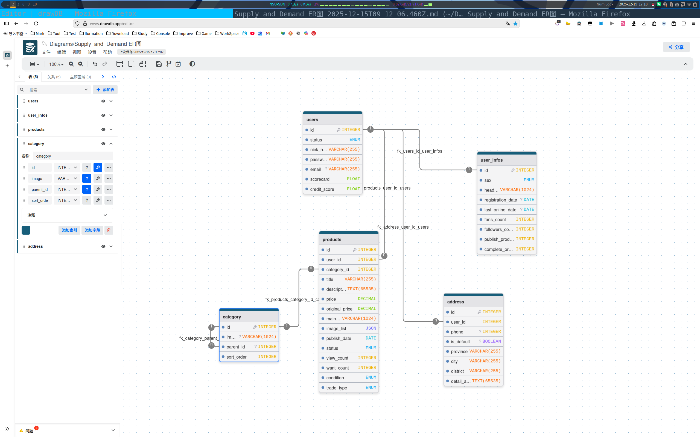
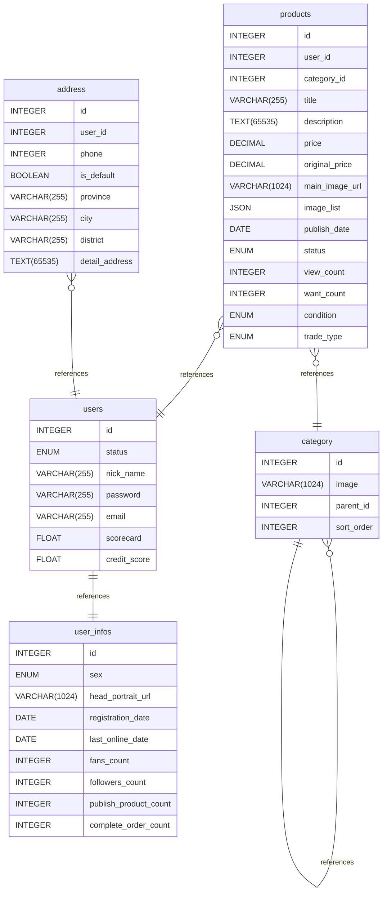

# Supply_and_Demand ER图 documentation
## Summary

- [Introduction](#introduction)
- [Database Type](#database-type)
- [Table Structure](#table-structure)
    - [users](#users)
    - [user_infos](#user_infos)
    - [products](#products)
    - [category](#category)
    - [address](#address)
- [Relationships](#relationships)
- [Database Diagram](#database-diagram)

## Introduction

> [文件链接](https://www.drawdb.app/editor?shareId=9bced306cbde5320c1b165f81f4c248d)

## Database type

- **Database system:** MySQL
## Table structure

### users

| Name        | Type          | Settings                      | References                    | Note                           |
|-------------|---------------|-------------------------------|-------------------------------|--------------------------------|
| **id** | INTEGER | 🔑 PK, not null, unique, autoincrement | fk_users_id_user_infos |用户ID |
| **status** | ENUM | not null, default: normal |  |用户状态 |
| **nick_name** | VARCHAR(255) | not null, unique |  |昵称 |
| **password** | VARCHAR(255) | not null |  | |
| **email** | VARCHAR(255) | null, unique |  | |
| **scorecard** | FLOAT | not null, default: 0 |  | |
| **credit_score** | FLOAT | not null, default: 100 |  | | 

### user_infos
用户信息
| Name        | Type          | Settings                      | References                    | Note                           |
|-------------|---------------|-------------------------------|-------------------------------|--------------------------------|
| **id** | INTEGER | 🔑 PK, not null, unique, autoincrement |  | |
| **sex** | ENUM | not null |  |性别 |
| **head_portrait_url** | VARCHAR(1024) | not null, default: 默认头像链接 |  | |
| **registration_date** | DATE | null |  | |
| **last_online_date** | DATE | null |  | |
| **fans_count** | INTEGER | not null, default: 0 |  | |
| **followers_count** | INTEGER | not null, default: 0 |  | |
| **publish_product_count** | INTEGER | not null, default: 0 |  | |
| **complete_order_count** | INTEGER | not null, default: 0 |  | |

### products
商品列表
| Name        | Type          | Settings                      | References                    | Note                           |
|-------------|---------------|-------------------------------|-------------------------------|--------------------------------|
| **id** | INTEGER | 🔑 PK, not null, unique, autoincrement |  | |
| **user_id** | INTEGER | not null | fk_products_user_id_users | |
| **category_id** | INTEGER | not null | fk_products_category_id_category | |
| **title** | VARCHAR(255) | not null |  | |
| **description** | TEXT(65535) | not null |  | |
| **price** | DECIMAL | not null |  | |
| **original_price** | DECIMAL | not null |  | |
| **main_image_url** | VARCHAR(1024) | not null |  | |
| **image_list** | JSON | not null |  |商品预览图列表 |
| **publish_date** | DATE | not null |  | |
| **status** | ENUM | not null, default: normal |  |商品状态 |
| **view_count** | INTEGER | not null, default: 0 |  | |
| **want_count** | INTEGER | not null, default: 0 |  | |
| **condition** | ENUM | not null |  | |
| **trade_type** | ENUM | not null |  | |

### category
商品类别
| Name        | Type          | Settings                      | References                    | Note                           |
|-------------|---------------|-------------------------------|-------------------------------|--------------------------------|
| **id** | INTEGER | 🔑 PK, not null, unique, autoincrement |  | |
| **image** | VARCHAR(1024) | null |  | |
| **parent_id** | INTEGER | null | fk_category_parent_id_category | |
| **sort_order** | INTEGER | not null, default: 0 |  | |

### address
地址
| Name        | Type          | Settings                      | References                    | Note                           |
|-------------|---------------|-------------------------------|-------------------------------|--------------------------------|
| **id** | INTEGER | 🔑 PK, not null, unique, autoincrement |  | |
| **user_id** | INTEGER | not null | fk_address_user_id_users | |
| **phone** | INTEGER | null |  | |
| **is_default** | BOOLEAN | null, default: False |  | |
| **province** | VARCHAR(255) | not null |  | |
| **city** | VARCHAR(255) | not null |  | |
| **district** | VARCHAR(255) | not null |  | |
| **detail_address** | TEXT(65535) | not null |  | |

## Relationships

- **users to user_infos**: one_to_one
- **products to users**: many_to_one
- **products to category**: many_to_one
- **category to category**: many_to_one
- **address to users**: many_to_one

## Database Diagram

